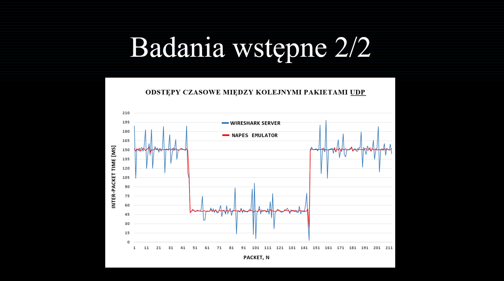

# NAPES

<h1>Runtime for IoT application components</h1>

  The aim of this master's thesis was to implement and test the NAPES runtime for Android, which is designed to emulate network traffic similar to that generated by any IoT application, using TCP and UDP protocols. NAPES loads the configurations defined in the RCR (Runtime Component Representation) components and based on the given parameters, starts emulating network traffic. This solution allows to test selected IoT networks for their performance and the ability to adapt to new changes in the network (e.g., adding a new node to the configured network). For this purpose, NAPES performs a state machine simulation and, according to the current state of the system, a network flow with appropriate parameters is generated. The conditions for changing states in the state machine are application events that have been implemented using the MQTT protocol.

  The scope of work includes the complete implementation of the runtime environment using Java and thorough testing of the emulator in terms of the accuracy of network traffic generation. The research part of the thesis contains the results of the accuracy measurements of network flow generation with various parameters and in various operating conditions of the environment. These accuracy measures were computed from a set of inter-packets times. The results of the measurements showed that the change of parameters has quite a small effect on the accuracy of the system, but some trends are observed. For example, as the amount of data transmitted per unit of time increases, the accuracy of sending network packets decreases. The impact of changing the thread priority in the system on the accuracy of network flow generation was also examined. The results of these studies showed that changing the priority has an ambiguous effect. In some cases, changing the priority improved generation accuracy, but worsened it in others.

