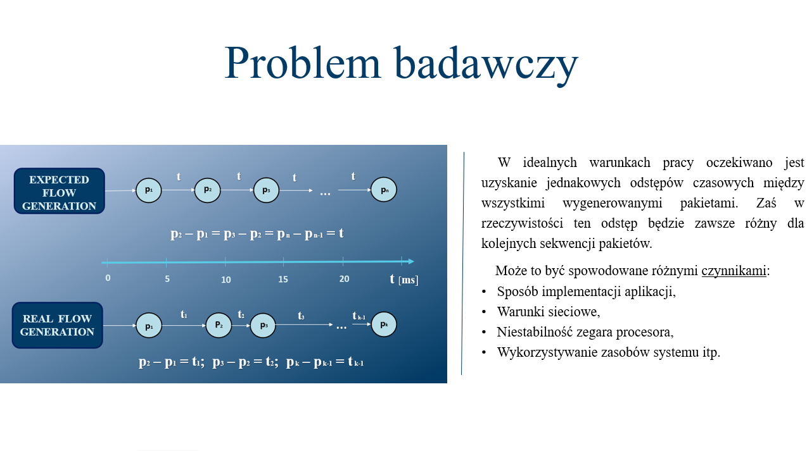

# NAPES

<h1>Runtime for IoT application components</h1>
<p>  The aim of this master's thesis was to implement and test the NAPES runtime for Android, which is designed to emulate network traffic similar to that generated by any IoT application, using TCP and UDP protocols. NAPES loads the configurations defined in the RCR (Runtime Component Representation) components and based on the given parameters, starts emulating network traffic. This solution allows to test selected IoT networks for their performance and the ability to adapt to new changes in the network (e.g., adding a new node to the configured network). For this purpose, NAPES performs a state machine simulation and, according to the current state of the system, a network flow with appropriate parameters is generated. The conditions for changing states in the state machine are application events that have been implemented using the MQTT protocol.</p>
<p>  The scope of work includes the complete implementation of the runtime environment using Java and thorough testing of the emulator in terms of the accuracy of network traffic generation. The research part of the thesis contains the results of the accuracy measurements of network flow generation with various parameters and in various operating conditions of the environment. These accuracy measures were computed from a set of inter-packets times. The results of the measurements showed that the change of parameters has quite a small effect on the accuracy of the system, but some trends are observed. For example, as the amount of data transmitted per unit of time increases, the accuracy of sending network packets decreases. The impact of changing the thread priority in the system on the accuracy of network flow generation was also examined. The results of these studies showed that changing the priority has an ambiguous effect. In some cases, changing the priority improved generation accuracy, but worsened it in others.</p>
<br/>

<p float="center">
  
  
  </p>

<h2>Motivation</h2>
<br/>

<p>  IoT devices are subject to a constant revolution, and the number of these devices is growing exponentially. Fig. 1 shows a graph showing how the number of smart devices increased over time. As you can see, in 2020 this number exceeded the value of 50 billion devices that can connect to the network (this is related to the transition to the IPv6 protocol).</p>

<p align="centr">


  
</p>
<p>  The computing power of these devices is increasing and the applications for them are becoming more and more complex. From this arise new problems when designing new applications or when implementing new changes to an already existing IoT network. The system designer should anticipate whether his new solution will not interfere with the operation of the operating system and network. For these purposes, there are many commercial solutions for Unix systems that are supported by IoT devices. One of the most popular solutions is the Iperf network performance measurement and configuration tool.
  As the performance of IoT devices themselves increases, they begin to support higher-level Unix-based systems, such as Android. As of today, there are few solutions on the market analogous to Iperf for Android systems. Therefore, the motivation for this work is to create a tool that would allow you to emulate a real application, while making various measurements that will be used to statistics on the performance of the network and the device itself.</p>
  
<h2>Architecture and implementation</h2>
<br/>

<p>  The basic unit of the NAPES runtime architecture is the component. This component describes the behavior of the state machine and ports running on a node. The implementation of such a system requires the use of multi-threaded programming, because network traffic generation is a different process than the state machine management process. Therefore, the component architecture can be divided into two main layers: the port support layer and the state machine support layer (Fig. 2).</p>

<p align="center">


  
</p>
<p>  The port handling layer decides what flow generator needs to run based on what state the state machine is in. This layer is designed to validate the flow parameters after each transition between states. The state machine support layer has various states declared within it, but it has only one current state. After starting the emulation, the FSM service layer is supposed to set the current state to the initial state that is declared in the component.
  
  Each port has rules defined in it, in which each state of the machine can have any flow generator assigned to it. The NAPES component distinguishes two types of events: local and application. Application events are implemented using the MQTT protocol. Sending an MQTT message to a "topic" that is subscribed to by any other component causes it to handle an input event. Local events perform the function of a timer that can only be started after transitioning between states by performing appropriate actions.
    
  Thanks to this, the components can communicate with each other and react to any changes in the entire NAPES ecosystem. Such an implementation allows you to change the state and generate any network flow. In general, the NAPES system and its components are designed in a way that allows the components to be dynamically created and run on the Android node, allowing for a more true network emulation of the application.Just as the system must work on Android systems, the Android Studio development environment was chosen for its development, which contains all the necessary tools to create such applications.
  
  The following network protocols were used during the system implementation: MQTT, TCP and UDP. Using the MQTT protocol, the system receives information about incoming application events or creates output actions itself. And the TCP and UDP protocols were used to generate heavy network traffic.</p>
  
  <h2>Tests</h2>
<br/>

<p>  The research part of this work will be focused on the accuracy of network traffic generation on the NAPES node. The actual time interval between sent packets and how it differs from the expected interval will be observed [7]. The smaller this difference is, the more accurate the system will be. The research part of this work can be divided into three main parts: preliminary tests, tests with different flow parameters and NAPES accuracy tests under different system operating conditions.
  
  The purpose of the preliminary test is to check the correct operation of the system, whether the implemented behavior of the system is in line with the expected one. In this experiment, network traffic will be observed from the level of a third-party application and compared with NAPES logs in order to verify the correctness of saving packet times during runtime. In this introductory study, the main features of the emulator will be presented:
  
• how a state machine works,
  
• how the system goes from one state to another
  
• and how flows change under different operating conditions.</p>

<p align="center">


  
</p>
<p>  The aim of the second part of the research will be to observe the reaction of the system to a change in the parameters of the generated network traffic. Inter-packet time will be taken into account in this test. Based on these time intervals, the basic measures of system accuracy will be calculated:
  
•	Mean,
  
•	Variance,
  
•	Standard deviation,
  
• Minimum packet spacing,
  
• Maximum interpacket spacing.
  
  Having these parameters, it will be possible to conclude how accurate the system is and how different parameters affect the accuracy of network traffic generation on an ordinary IoT device.
  
  NAPES accuracy tests under different system operating conditions - this experiment is designed to investigate the effect of changing the priority of the thread through which the network flow is generated. The Android API has tools that allow you to change thread priorities at the system level.</p>


<h2>Code snippet used when testing the accuracy of sending packets</h2>


``` java
while (Config.simulating) { // do póki flaga symulacji == true

  // pętla sprawdzająca każdy state flow
  for(StateFlow stateFlow:port.getClientInfo().getStateFlowList().getStateFlows()){

    // deklaracja parametrów StateFlow
    String stateName = stateFlow.getsName();
    String stateMachineName = stateMachine.getmName();
    // sprawdź czy przetwarzany StateFlow  zgadza się z aktualnym stanem FSM
    if (map.get(stateMachineName).equals(stateName)) {
      // zapis czasu rozpoczęcia przepływu do pliku JSON
      String currentTime = (Long.toString(System.currentTimeMillis()));
      // ustaw aktualny przepływ na porcie
      Flow currentFlow = getCurrentFlow(stateFlow);
      //ustawienie priorytetu wątków
      android.os.Process.setThreadPriority(getPriority(currentFlow)); 
      //tworzenie klienta
      UdpClient udpClient = new UdpClient(handler, port, currentFlow);
      // ustawienie odstępów między pakietami
      long timeOut = currentFlow.getRealTimeDelay() * 1_000_000;
      currentFlowBuf = currentFlow.getfType();
      // zapis czasu przed przetwarzaniem
      long timer = System.nanoTime();
      // pętla przetwarzająca przepływ
      while (map.get(stateMachine.getmName()).equals(stateName) &&
                                                  Config.simulating) {
        udpClient.sendThroughLink(); // wysłanie pakietu
        tempTime = System.nanoTime() - timer;

        // Jeśli czas przetwarzania był większy niż
        odstęp między pakietami, to kontynuuj pętlę
        if (tempTime - timeOut >= 0) {
          timer = System.nanoTime();
          continue;
        } else {
          long timeToSleepNs;
          timer = System.nanoTime() - timer; // uwzglednianie czasu przetwarzania
          timeToSleepNs = timeOut - timer; // odstęp czasowy - czas przetwarzania
          try {
            // czekanie
            TimeUnit.NANOSECONDS.sleep(timeToSleepNs);
          } catch (InterruptedException e) {
            e.printStackTrace();
          }
          // ustaw timer przetwarzania
          timer = System.nanoTime();
        }

      }
    }
 }

```





